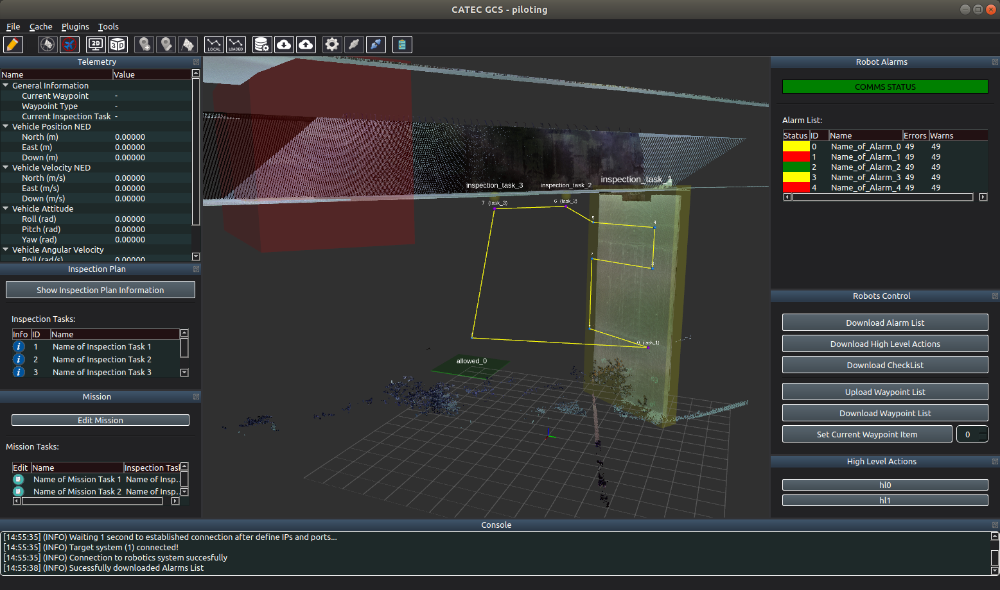
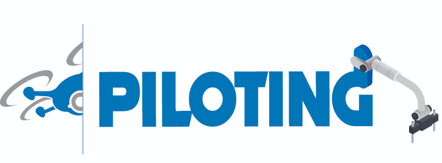

# PILOTING General Robot Control Station

This repository contains the gRCS (General Robot Control Station) developments of the PILOTING H2020 project.



## Dependencies installation

---

### Build essentials and cmake
```
sudo apt-get install build-essential cmake
```

### Qt5
```
sudo apt-get install qt5-default
```

### QsLog

Clone [QsLog](https://github.com/fada-catec/qslog) on your third-party dependencies folder and follow the installation instructions.

### ROS(Robot Operative System)

Follow up your ROS distro installation guide: [Melodic](http://wiki.ros.org/melodic/Installation/Ubuntu) or [Noetic](http://wiki.ros.org/noetic/Installation/Ubuntu)


### PILOTING MAVSDK
On your third-party dependencies folder:
```
git clone https://github.com/fada-catec/piloting_mavsdk && cd piloting_mavsdk

mkdir build && cd build

cmake .. -DCMAKE_BUILD_TYPE=Release && make -j{n_proc}

sudo make install
```

## Building guide

---

There are two ways:

* Creating a catkin workspace by the default compiler way of ROS:
```
mkdir -p grcs_ws/src && grcs_ws/src && git clone https://github.com/fada-catec/piloting_grcs

cd .. && catkin_make -DCMAKE_BUILD_TYPE=Release
```

* Via the default way of cmake creating a build folder:
```
git clone https://github.com/fada-catec/piloting_grcs && cd piloting_gcs

mkdir build && cd build && cmake .. -DCMAKE_BUILD_TYPE=Release

make
```

## Usage guide
---

The following is a short guide to the implementation of the application and connection to the robotic vehicles and the DDHL portal.

### Launch application
If catkin has been used, it is sufficient to use:
```
source devel/setup.bash

rosrun piloting_grcs piloting_grcs_node
```

In case cmake has been used, inside the build folder the executable will be:
```
./devel/lib/piloting_grcs/piloting_grcs
```

### Conection with Data Distribution & Harmonization Layer (DDHL)

The connection with the DDHL is made throw REST-API. This is the website of the DDHL portal: https://portal.piloting-project.eu/login (If you need credentials, please contact the I&M portal administrators)

### Conection with robotic vehicles

The connection with robotic vehicles are made throw mavsdk library. To know how to integrate the masdk robotic side in your robot using ROS take a look to the [piloting-mavsdk-ros](https://github.com/fada-catec/piloting-mavsdk-ros) repository.

Note that we can only connect to the robotic vehicle once we have downloaded an inspection plan from gRCS.

## Docker container guide

Follow the README file located inside the [docker folder](./docker/).

## Help / Contribution

* Contact: **Marco A. Montes** (mmontes@catec.aero) or **Joaquín Borrego** (jborrego@catec.aero)

       

* Found a bug? Create an ISSUE!

* Do you want to contribute? Create a PULL-REQUEST!

## Acknowledgement

---


Supported by PILOTING - PILOTs for robotic INspection and maintenance Grounded on advanced intelligent platforms and prototype applications.
More information: <a href="https://piloting-project.eu/">piloting-project.eu</a>

  

This project has received funding from the European Union's Horizon 2020  
research and innovation programme under grant agreement 871542.

